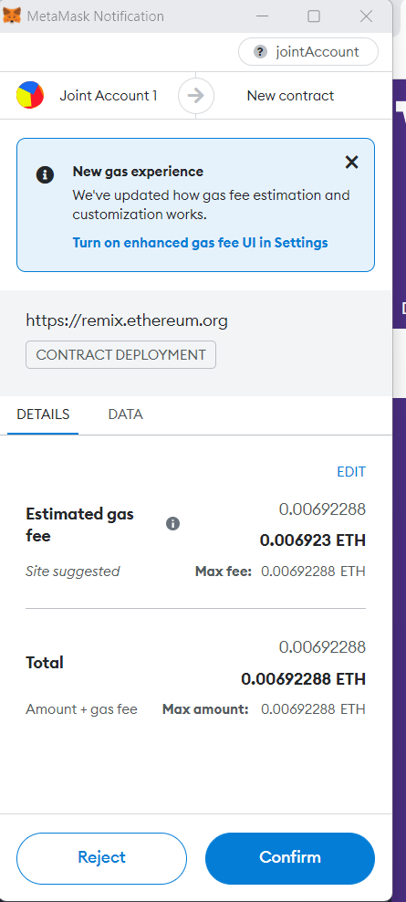
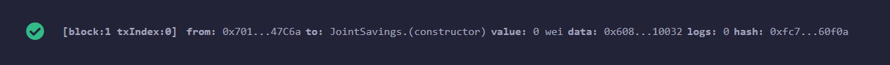
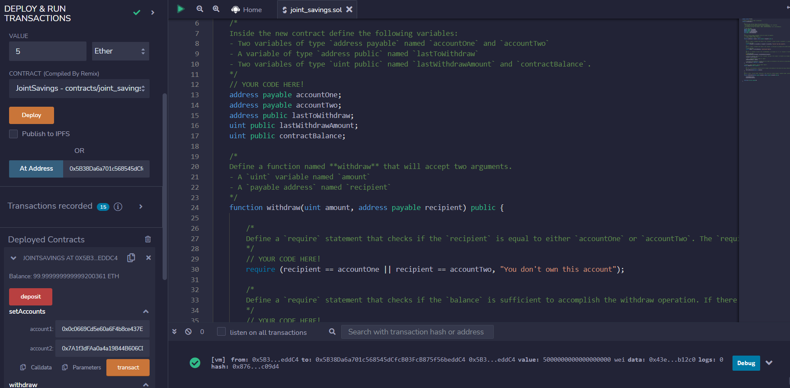
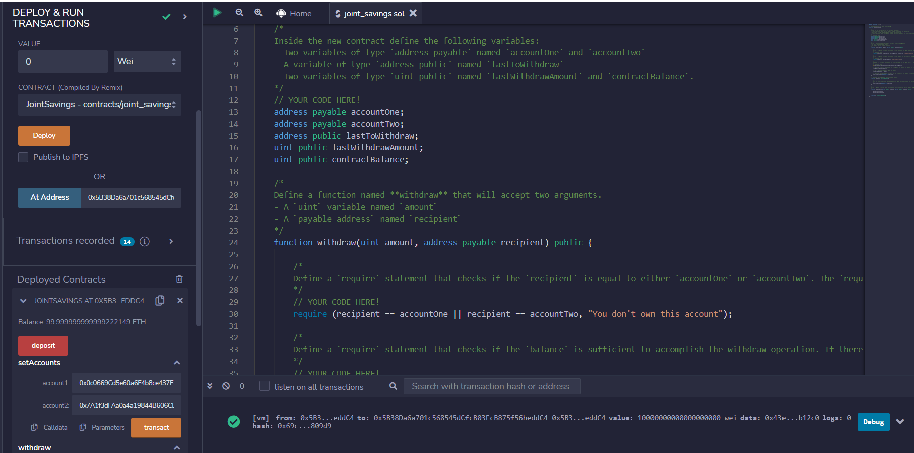
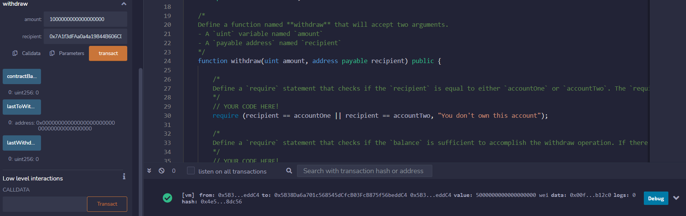
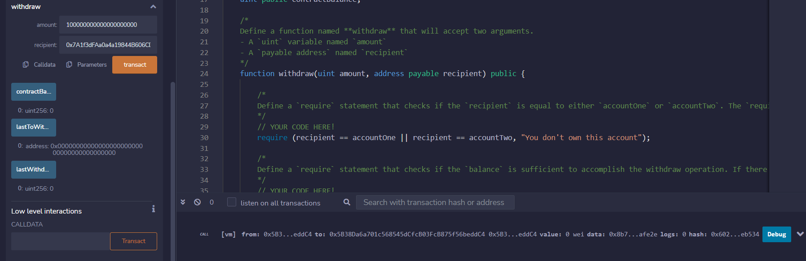

# Solidity-Smart-Contract
UW Fintech Bootcamp Challenge 20

---

## Technologies

The following technology was used in this assignment:  
  
  * remix  
  * ganache
  * metamask  
  
---

## Purpose of Project

The main purpose of this project is to build a smart contract and deploy it on a test network    
  
---

## Examples

The below images show the various required screen captures: 
 
 
 
 
  
   
    
   
 
   
 
   

   
  
  

Overall I can certainly see the value of of such technology and the ability to work with it enhancing my career opportunities as a fintech professional.  

---

## Contributors

The majority of this project has been done independently, with assistance from Aarti Couture.

---

## License

Program is free to use without license.  Only request is that you notify author of use and application.
  
To discuss usage or general inquires please contact the author at jonm5214@gmail.com